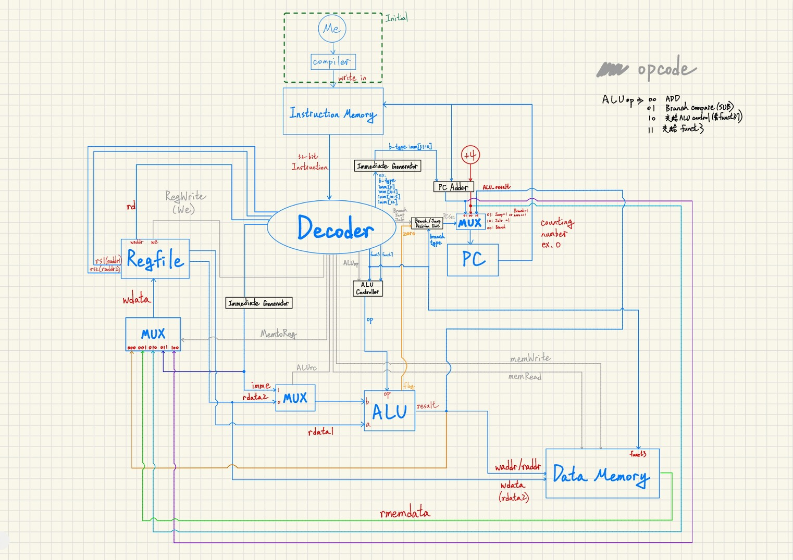
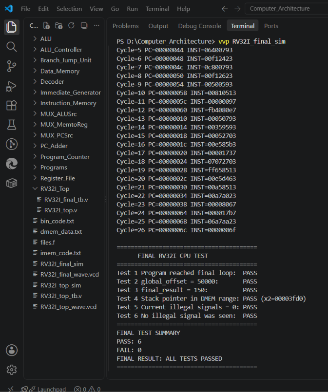

# RV32I Single-Cycle CPU

A 32-bit single-cycle RV32I processor implemented in Verilog, featuring separate byte-addressed instruction and data memories with little-endian organization. The processor supports integer arithmetic and logical operations, load/store instructions, conditional branches, and jump instructions. The complete design was verified by executing a bare-metal C program compiled with the RISC-V GCC toolchain.

## Key Features

- 32-bit RV32I single-cycle datapath
- 32 × 32-bit register file with x0 hardwired to zero
- Separate 16 KiB byte-addressed instruction and data memories
- Little-endian memory organization
- Support for R-, I-, S-, B-, U-, and J-type instruction formats
- Conditional branch and jump support, including JAL and JALR
- Separate illegal-condition indicators for major control blocks
- Bare-metal C program execution using the RISC-V GCC toolchain

## Architecture

The processor is organized as a single-cycle datapath with separate instruction and data memories. Instruction decoding, immediate generation, ALU execution, branch/jump decisions, memory access, and register write-back are completed within a single instruction cycle.



The program counter (PC) addresses the instruction memory, and the decoded instruction controls the register file, ALU, memory access, and write-back paths. The next PC is selected from sequential execution (`PC + 4`), branch/jump targets (`PC + immediate`), or the JALR target generated by the ALU. Write-back data is selected according to the instruction type and returned to the register file.

## Supported ISA

| Category | Instructions |
| --- | --- |
| R-type | ADD, SUB, SLL, SLT, SLTU, XOR, SRL, SRA, OR, AND |
| I-type ALU | ADDI, SLLI, SLTI, SLTIU, XORI, SRLI, SRAI, ORI, ANDI |
| Load | LB, LH, LW, LBU, LHU |
| Store | SB, SH, SW |
| Branch | BEQ, BNE, BLT, BGE, BLTU, BGEU |
| Upper | LUI, AUIPC |
| Jump | JAL, JALR |

This project targets the RV32I base integer ISA and does not implement extensions such as M, A, F, D, C, or V.

## Memory Organization

The processor uses separate 16 KiB instruction and data memories. Both memories are byte-addressed and follow little-endian byte ordering.

- **Instruction Memory:** 16 KiB, byte-addressed, combinational read
- **Data Memory:** 16 KiB, byte-addressed
- **Load:** combinational read
- **Store:** synchronous write
- **Byte order:** little-endian

For example, the 32-bit value `0x12345678` is stored as:

| Address | Data |
| --- | --- |
| `addr + 0` | `0x78` |
| `addr + 1` | `0x56` |
| `addr + 2` | `0x34` |
| `addr + 3` | `0x12` |

The corresponding `LW` and `SW` datapaths are implemented as:

```verilog
// LW
3'b010: mem_data = {
    mem[alu_result+3],
    mem[alu_result+2],
    mem[alu_result+1],
    mem[alu_result]
};

// SW
mem[alu_result+3] <= wdata[31:24];
mem[alu_result+2] <= wdata[23:16];
mem[alu_result+1]  <= wdata[15:8];
mem[alu_result]     <= wdata[7:0];
```

## Verification

Verification was performed at both the module and processor levels, followed by an end-to-end execution test using a bare-metal C program compiled with the RISC-V GCC toolchain.

- **Module-level verification:** Individual RTL modules were tested with dedicated Verilog testbenches.
- **CPU integration verification:** The complete datapath and control logic were verified using `RV32I_final_tb.v`.
- **Software execution:** A GCC-compiled bare-metal C program was executed on the processor to verify instruction flow, memory access, function calls, branches, and register write-back.



The final integration test completed with **6/6 checks passed**, including the expected `global_offset = 50000`, `final_result = 150`, valid stack-pointer placement, successful program termination at the final loop, and no illegal-condition assertion during execution.

See [Verification Details](docs/verification.md) for the complete verification methodology and module-level test coverage.
